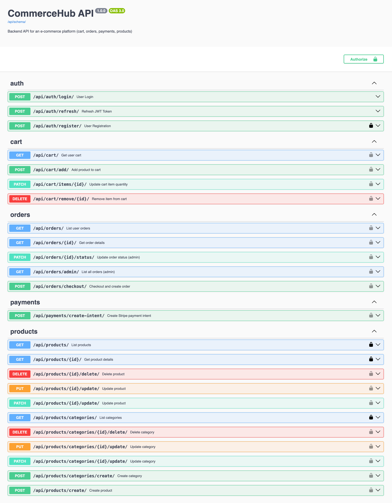
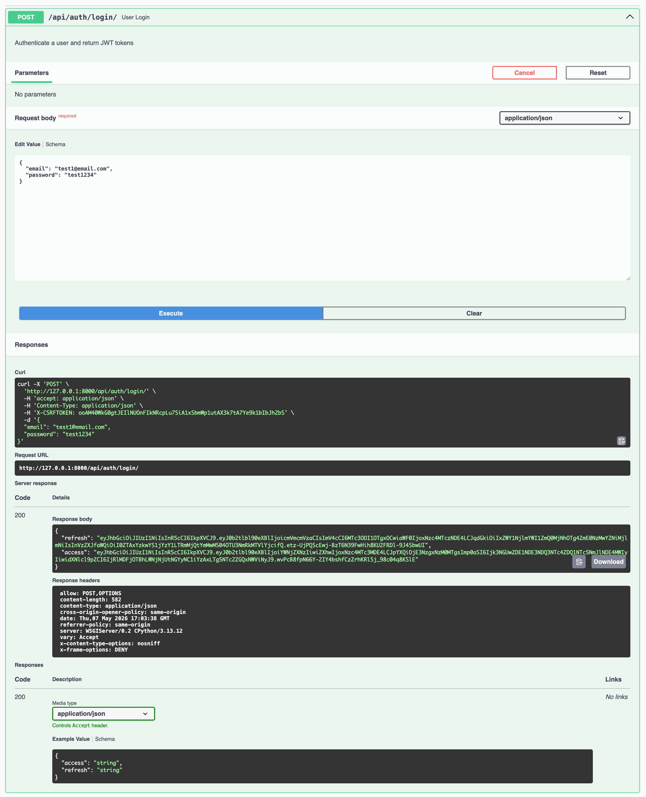
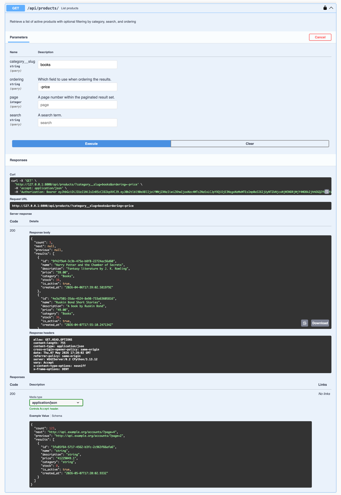
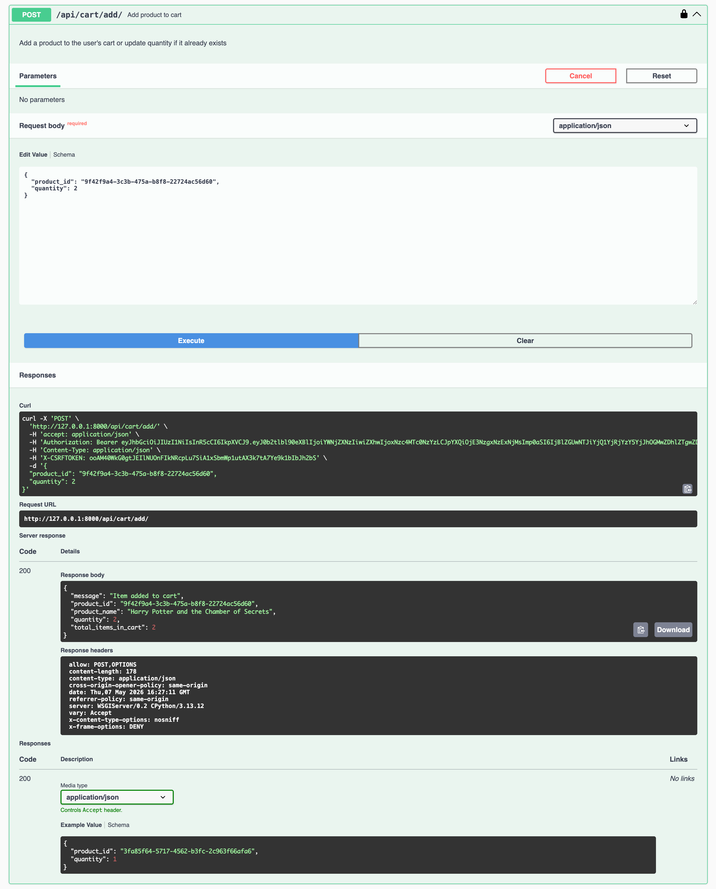
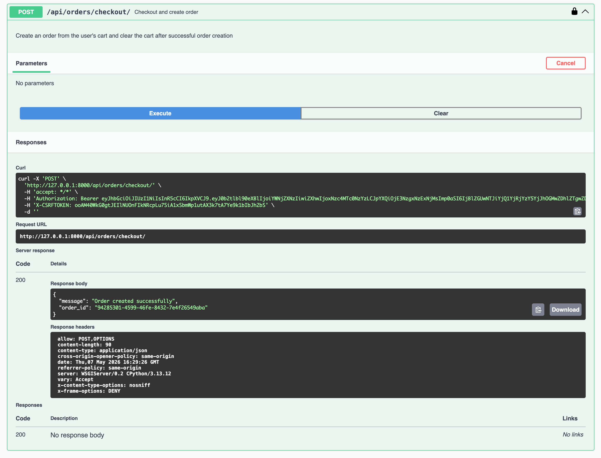
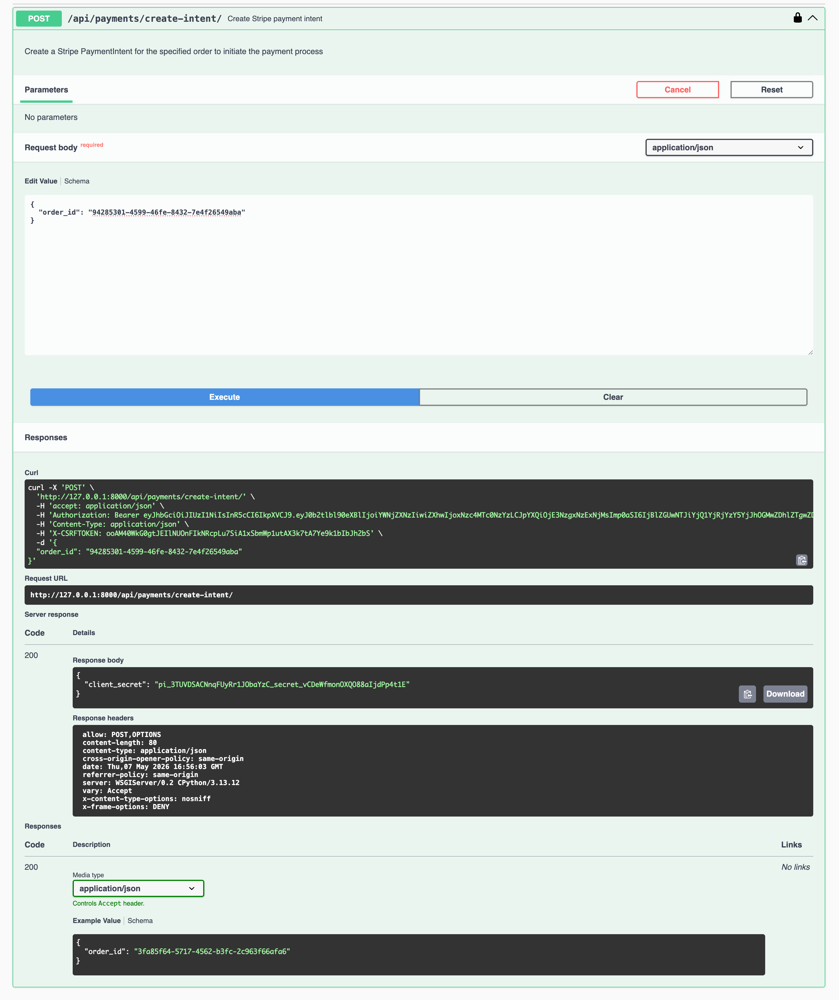
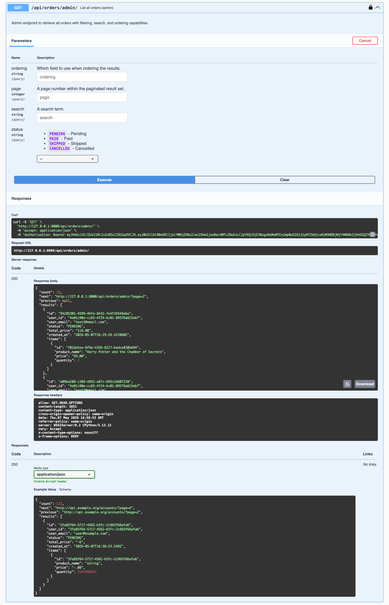
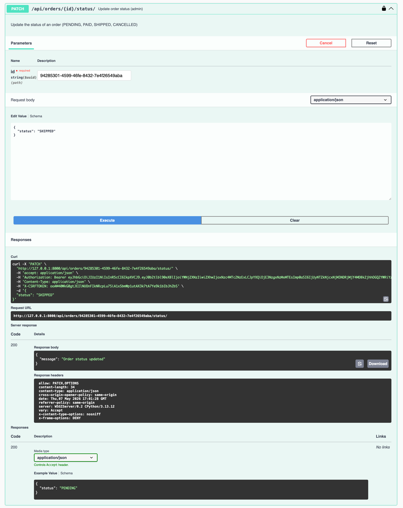

# CommerceHub API
A production-ready E-commerce REST API built with Django REST Framework.

Supports authentication, products, cart management, order processing, inventory tracking, Stripe payments, filtering, pagination, throttling, and Swagger API documentation.


## Backend Highlights

- Clean RESTful API design
- JWT authentication with protected endpoints
- UUID-based primary keys across products, orders, categories, and cart resources
- Stripe payment integration
- Custom object-level permissions
- Nested routing
- DRF filtering, searching, ordering, and pagination
- Throttling (rate limiting)
- Production-aware architecture decisions

## Purpose & User Flow

Users can:
- register and authenticate using JWT
- browse and search products
- add products to cart
- manage cart quantities
- checkout and create orders
- make payments using Stripe
- track order status

Admins can:
- manage products and categories
- monitor customer orders
- update order statuses
- manage inventory stock


## Tech Stack
- Python
- Django
- Django REST Framework
- PostgreSQL
- JWT authentication
- Stripe API
- drf-spectacular (Swagger/OpenAPI)


## Core Modules

**Authentication:** 
- JWT authentication
- Login / refresh token
- Protected routes
- Role-based permissions

**Products:** 
- CRUD operations
- Category management
- Search
- Filtering
- Ordering
- Pagination

**Cart:** 
- Add/remove/update items
- Quantity validation
- Stock validation

**Orders:** 
- Checkout system
- Order history
- Admin order management
- Order status updates

**Payments**
- Stripe PaymentIntent integration
- Payment validation
- Duplicate payment prevention

**Security & Production Features**
- API throttling
- Rate limiting
- Swagger/OpenAPI documentation
- Pagination
- Permission control


## API Documentation Preview
Below are selected screenshots from the Swagger documentation demonstrating core features of the API.

### Complete Swagger API Documentation
Interactive API documentation covering authentication, products, cart management, order processing, payments, filtering, and admin operations.


---

### JWT Authentication System
Secure authentication using JSON Web Tokens with login, refresh token handling, and protected API access.


---

### Product Search, Filtering & Ordering
Retrieve products with advanced query support including category filtering, keyword search, and dynamic price ordering using Django REST Framework filters.


---

### Cart Management System
Authenticated users can add products to their cart with automatic quantity handling and real-time cart updates.


---

### Checkout Workflow
Convert cart items into a complete order while automatically clearing the cart after successful checkout.


---

### Stripe Payment Intent API
Secure Stripe PaymentIntent integration for handling online payments and initiating transaction workflows.


---

### Admin Order Dashboard API
Admin-only endpoint to retrieve all orders with nested order items, filtering, searching, and ordering capabilities.


---

### Order Status Management
Admin users can update order lifecycle states such as PENDING, PAID, SHIPPED, and CANCELLED.


---


## Future Enhancements

- Email notifications
- Coupon/discount system
- Product reviews & ratings
- Wishlist functionality
- Redis caching
- Celery background jobs


## Setup Instructions

1. **Clone the repository:**
   ```bash
    git clone <repo>
    cd commercehub-api
    python -m venv venv
    source venv/bin/activate
    pip install -r requirements.txt
   ```

2. **Create .env:**
    ```ini
    SECRET_KEY=your_django_secret_key
    DEBUG=True
    DB_NAME=your_database_name
    DB_USER=your_database_user
    DB_PASSWORD=your_database_password
    DB_HOST=localhost
    DB_PORT=5432
    STRIPE_SECRET_KEY=your_stripe_secret_key
    STRIPE_WEBHOOK_SECRET=your_stripe_webhook_secret(whsec_..)
    ```


3. **Run:**
   ```bash
    python manage.py migrate
    python manage.py runserver
   ```

4. **Swagger available at:**
    ```ini
    /api/docs/
    ```


Author: **Souvik Sinha**